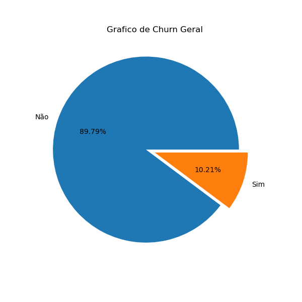

# churn-prediction-logistic-regression
Customer churn analysis using Python, EDA and Logistic Regression (Statsmodels).

📌 **Contexto do Problema e Objetivo de Negócio**

O custo de aquisição de um novo cliente (CAC) é significativamente maior do que o custo de retenção. Neste cenário, a empresa vinha sofrendo com uma taxa de cancelamento (Churn) de 10,21%, e gostaria de insights para reduzir essa taxa.

O grafico acima informa que 8979 não canceraram o serviço, porém, 1021 cancelaram o serviço.

**Objetivo:** Identificar os principais fatores que levam ao cancelamento, visando trazer a empresa insights orientados por dados para reduzir a taxa de churn.

Fonte dos dados: https://www.kaggle.com/datasets/miadul/customer-churn-prediction-business-dataset/data

## 🛠️ Tecnologias e Ferramentas Utilizadas

*   **Linguagem:** Python
*   **Manipulação e Análise de Dados:** Pandas, NumPy
*   **Visualização:** Matplotlib, Seaborn
*   **Machine Learning:** Statsmodel (Algoritmos: Regressão Logística)

---

## 📊 Principais Insights da Análise Exploratória (EDA)

*   **Insight 1:** Quanto maior o número de mesês como cliente, menor a ocorrência de churn, a cada mês é reduzido aproximadamente 2,5% a possibilidade de Churn.
*   **Insight 2:** Existe uma corelação baixa(>~3%), porém persistente, que indica que quanto menos vezes o cliente acessa a plataforma, o indice de churn sobe. 
*   **Insight 3:** Quando o indice de satisfação do cliente sobe (csat_score) a taxa de churn desce estatisticamente ~56%.
*   **Insight 4:** Detalhe de importância alta é o indice de pagamentos falhos, que a cada pagamento aumenta estatisticamente ~46% a chance de churn.

---

## 🤖 Desenvolvimento do Modelo de Machine Learning

O pipeline de dados envolveu etapas de tratamento de valores nulos, codificação de variáveis categóricas (*One-Hot Encoding*)..

---

## 📈 Impacto Financeiro Estimado (Resultados de Negócio)

Ao aplicar o modelo na base de clientes, conseguimos mapear o grupo de maior risco de churn. 

---

## 📂 Estrutura do Repositório

*   `data/`: Pasta com a base de dados utilizada.
*   `notebooks/`: O arquivo principal `analise_churn.ipynb` com todo o código.
*   `images/`: Gráficos exportados utilizados neste relatório.

---

## 👋 Contato

Desenvolvido por **Felipe Pocai**  
*   LinkedIn: www.linkedin.com/in/felipe-pocai-12773731
*   E-mail: felipepocai@hotmail.com
